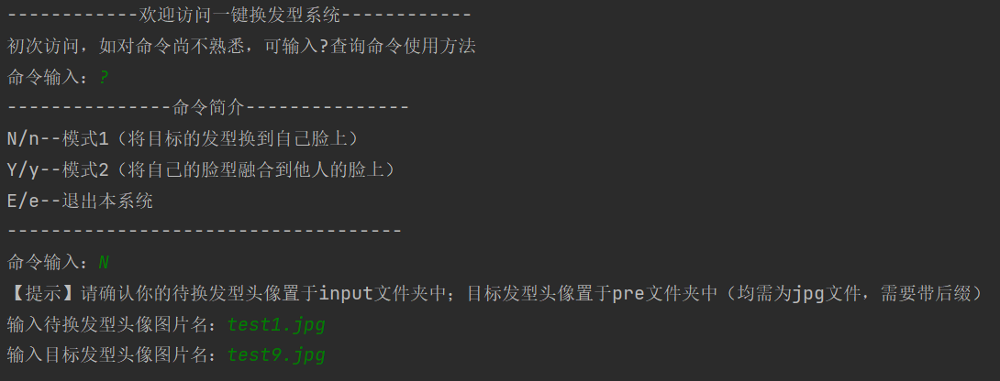
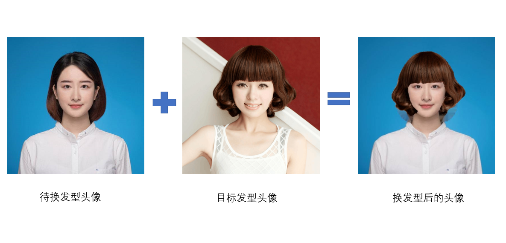

# AI_Barbershop项目使用手册

作者：杨政、魏嘉林

## 项目介绍

### 主要功能

本项目主要功能为AI智能换发型。用户上传**代换发型、目标发型**图片文件至系统后，可选择两种形式实现该换发型操作：①将目标的发型换到自己脸上（N模式）；②将自己的脸型融合到他人的脸上（Y模式）。

### 交互模式

本项目为命令行交互界面，用户可以通过命令输入运行本系统。命令行页面如下所示：

### 运行效果

#### N模式

## Y模式

声明：以上图片源于互联网，仅供学习使用。如有侵权，联系作者后将立即删除。

## 运行步骤

本项目通过运用飞桨的神经网络框架，对发型、人脸识别点做出识别分析，使用open-cv、numpy等python库，实现了AI换发型的相应操作。

以下，列出项目所需运行环境配置的相应步骤（顺序有先后）：

- **先决条件**：python环境（建议版本3.9.0），pip（建议版本22.1.2）

- pip install opencv-python==4.5.1.48

- pip install numpy==1.23.1

- python -m pip install paddlepaddle-gpu==2.3.1 -i https://mirror.baidu.com/pypi/simple

  附注：不同系统配置可能不同，详情请见[飞桨-源于产业实践的开源深度学习平台 (paddlepaddle.org.cn)](https://www.paddlepaddle.org.cn/install/quick?docurl=/documentation/docs/zh/install/pip/windows-pip.html)

- hub install face_landmark_localization==1.0.3

  附注：详见[Face_landmark_localization模型库下载](https://www.paddlepaddle.org.cn/hubdetail?name=face_landmark_localization&en_category=KeyPointDetection)

- hub install ace2p==1.1.0

  附注：详见[ace2p模型库下载](https://www.paddlepaddle.org.cn/hubdetail?name=ace2p&en_category=ImageSegmentation)

环境配置好后：

- 重启pycharm，等待索引加载。（若为命令行方式打开可忽略）
- 运行app.py文件，使用命令行模式运行系统。

## 参考文献/网址

[^1]: [OpenCV中文官方文档 (woshicver.com)](http://woshicver.com/)
[^2]: [飞桨PaddlePaddle-源于产业实践的开源深度学习平台](https://www.paddlepaddle.org.cn/hubdetail?name=face_landmark_localization&en_category=KeyPointDetection)
[^3]: https://matthewearl.github.io/2015/07/28/switching-eds-with-python/
[^4]: https://blog.csdn.net/djstavaV/article/details/119091621

